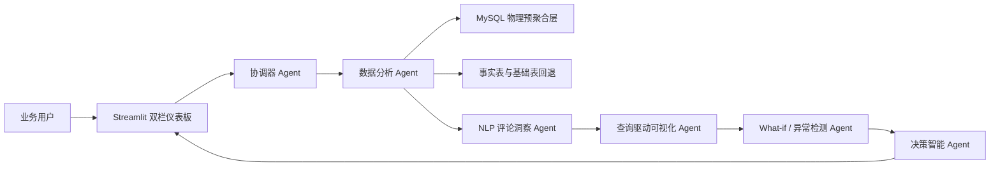
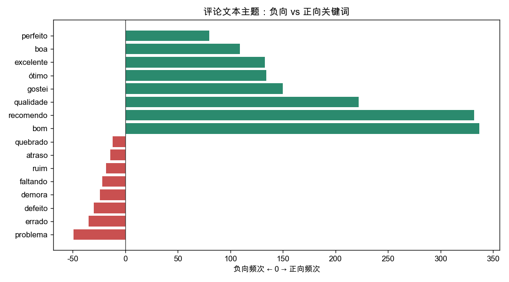

# Agentic BI 驱动的 Olist 多表电商运营分析与决策智能系统项目报告

## 1. 项目背景与动机

传统商业智能系统通常依赖分析人员手工编写 SQL、制作固定看板，并由业务人员自行解释指标变化。面对 Olist 这类包含订单、商品、卖家、支付、物流与评论文本的多表电商数据，固定看板难以覆盖临时业务问题，多表实时 JOIN 也会带来响应延迟。

本项目构建一个面向非技术业务人员的 Agentic BI 系统，使用户能够通过自然语言完成描述性、诊断性、预测性和规范性分析。系统自动规划任务、优先查询物理预聚合表、回退基础表、生成与本轮问题相关的图表，并综合数据、预测、评论文本、What-if 和异常检测结果输出可执行建议。

项目目标包括：

- 降低跨表数据分析的使用门槛；
- 通过预聚合层提高高频查询响应速度；
- 使用多智能体协作覆盖查询、可视化、文本洞察和决策；
- 为运营人员提供带指标、对象和复盘周期的行动建议。

## 2. 系统架构设计图



系统由交互层、Agent 编排层、分析模型层和 MySQL 数据层组成。LangGraph 使用单轮共享状态在 Agent 间传递用户问题、SQL、数据结果、评论洞察、预测和决策建议。每次点击分析都会创建独立运行状态，避免上一轮结果污染当前问题；同一输入中的复合问题仍可在子问题之间传递年份、州等必要上下文。

数据分析 Agent 优先访问物理预聚合层。只有当问题需要订单明细、评论正文或预聚合未覆盖的维度时，才回退至 `fact_order_items` 或基础表。可视化 Agent 不再固定返回整套看板，而是根据本轮问题、命中数据源和结果字段动态选择折线图、柱状图、热力图、散点图、气泡图或评论主题图。

## 3. 关键技术选型说明

| 技术领域 | 选型 | 选型原因 |
| --- | --- | --- |
| 大语言模型 | DeepSeek OpenAI 兼容接口 | 用于自然语言转 SQL、结果解释与规范性建议；不可用时支持规则兜底 |
| Agent 框架 | LangGraph `StateGraph` | 支持条件路由、单轮共享状态和复合问题协作 |
| 查询引擎 | MySQL 8 | 满足课程要求，支持多表 JOIN、物理汇总表和索引 |
| 数据处理 | Pandas + SQLAlchemy | 完成 CSV 导入、DataFrame 处理和数据库访问 |
| 预测模型 | 对数尺度阻尼 Holt 趋势 | 从问题中动态提取预测周数，使用最近 39 个完整周预测；对数变换保证 GMV 非负，经验残差给出 90% 区间 |
| NLP 方法 | 葡萄牙语情感词典、停用词和主题词频 | 对评论正文生成极性、主观性和主题关键词 |
| 可视化 | Matplotlib | 支持动态生成并保存折线、柱状、热力、散点和气泡图 |
| Web 界面 | Streamlit | 快速实现双栏仪表板、单轮分析历史、SQL 与图表展示 |

## 4. 预聚合视图设计专节

### 4.1 物理预聚合表

系统采用可刷新的 MySQL 物理汇总表，而不是普通逻辑 View，以便获得稳定的性能提升。

| 表名 | 粒度 | 核心用途 |
| --- | --- | --- |
| `mv_monthly_sales` | 年月 | GMV 趋势与客单价分析 |
| `mv_weekly_sales` | 周 | 动态周数 GMV 预测输入 |
| `mv_state_sales` | 年月、州 | 州级销售排名与区域对比 |
| `mv_category_sales` | 年月、品类 | 品类表现分析 |
| `mv_delivery_perf` | 年月、州 | 配送时长、准时率和延迟诊断 |
| `mv_payment_dist` | 年月、支付方式 | 支付偏好与平均分期数 |
| `mv_payment_installment_matrix` | 支付方式、分期数 | 支付分期热力图 |
| `mv_weight_freight_bucket` | 重量分桶 | 重量、运费和配送时长关系 |
| `mv_state_geo_sales` | 州 | 州级地理气泡图 |
| `mv_review_quality` | 年月、州、品类 | 评论评分与差评率 |
| `mv_seller_review_risk` | 卖家 | 高差评卖家定位与 What-if |

完整 SQL 位于 `utils/sql/create_materialized_views.sql`。代表性定义如下：

```sql
CREATE TABLE mv_monthly_sales AS
SELECT
    `year_month`,
    SUM(item_gmv) AS total_gmv,
    COUNT(DISTINCT order_id) AS total_orders,
    SUM(item_gmv) / NULLIF(COUNT(DISTINCT order_id), 0) AS avg_basket,
    SUM(freight_value) AS total_freight
FROM fact_order_items
GROUP BY `year_month`;
```

```sql
CREATE TABLE mv_weekly_sales AS
SELECT
    DATE_SUB(DATE(order_purchase_timestamp), INTERVAL WEEKDAY(order_purchase_timestamp) DAY) AS week_start,
    SUM(item_gmv) AS total_gmv,
    COUNT(DISTINCT order_id) AS total_orders,
    SUM(item_gmv) / NULLIF(COUNT(DISTINCT order_id), 0) AS avg_basket,
    SUM(freight_value) AS total_freight
FROM fact_order_items
GROUP BY week_start;
```

```sql
CREATE TABLE mv_delivery_perf AS
SELECT
    `year_month`,
    customer_state,
    AVG(shipping_duration_days) AS avg_delivery_days,
    AVG(is_on_time) AS on_time_rate,
    SUM(CASE WHEN is_on_time = 0 THEN 1 ELSE 0 END) AS delayed_orders,
    COUNT(DISTINCT order_id) AS total_orders
FROM fact_order_items
WHERE shipping_duration_days IS NOT NULL
GROUP BY `year_month`, customer_state;
```

### 4.2 Agent 利用与回退机制

`agents/data_analyst.py` 的数据字典和 Prompt 明确要求优先选择 `mv_*`。高频验收问题同时配置确定性规则，例如州销售问题命中 `mv_state_sales`、配送问题命中 `mv_delivery_perf`、支付分期矩阵命中 `mv_payment_installment_matrix`。评论正文等未被预聚合覆盖的问题自动回退基础表。

仪表板固定展示本轮 SQL、命中数据源与查询策略，便于验证预聚合优先逻辑。


### 4.3 性能对比

在同一 MySQL 数据环境下，对月度 GMV 执行原表 JOIN 聚合与物理预聚合查询：

- 原表 JOIN 聚合：`271.4ms`
- 查询 `mv_monthly_sales`：`1.696ms`
- 实测加速：约 `160.1x`


## 5. 数据集描述与预处理步骤

项目使用 Brazilian E-Commerce Public Dataset by Olist，覆盖 2016 年至 2018 年的订单、商品、客户、卖家、支付、评论与地理信息。

### 5.1 九张基础表

| 表 | 主要内容 |
| --- | --- |
| `orders` | 订单状态与完整时间链路 |
| `order_items` | 商品、卖家、价格与运费 |
| `customers` | 客户唯一标识、城市和州 |
| `products` | 品类、重量和尺寸 |
| `sellers` | 卖家城市和州 |
| `order_payments` | 支付方式、分期数和金额 |
| `order_reviews` | 评分、标题和评论正文 |
| `geolocation` | 邮编、经纬度、城市和州 |
| `product_category_name_translation` | 葡萄牙语品类英文翻译 |

### 5.2 预处理流程

1. `python -m utils.db_init` 将九个 CSV 导入 MySQL。
2. `python -m utils.etl` 构建 `fact_order_items` 事实宽表。
3. ETL 生成 `item_gmv`、`year_month`、`shipping_duration_days` 和 `is_on_time` 等衍生字段。
4. 使用英文品类翻译表统一商品品类名称。
5. 对缺失送达时间的记录保留明细，但在配送时长聚合中排除。
6. `python -m utils.refresh_views` 一键重建全部物理预聚合表和索引。

## 6. 智能体实现和多智能体调度方法

### 6.1 Agent 职责

| Agent | 核心职责 |
| --- | --- |
| 协调器 Agent | 识别分析类型，设置预测、NLP、What-if、异常和决策标记 |
| 数据分析 Agent | 自然语言转 SQL，预聚合优先，失败自动回退，生成业务摘要 |
| NLP 评论洞察 Agent | 对评论正文计算极性、主观性和主题关键词 |
| 可视化 Agent | 根据本轮问题、数据源和结果字段动态选择并生成相关图表 |
| What-if / 异常检测 Agent | 模拟下架高差评卖家，检测州级订单骤降 |
| 决策智能 Agent | 综合数据、预测、NLP、What-if 和异常结果输出行动建议 |

### 6.2 调度流程

协调器首先判断问题意图；数据分析 Agent 查询数据后，若需要评论洞察则进入 NLP 节点；随后可视化 Agent根据本轮结果动态生成图表；若问题包含 What-if 或异常意图，则进入加分分析节点；最后决策 Agent 汇总全部证据。

动态图表选择示例：

- 月度趋势问题：月度折线图；预测问题：按用户指定周数生成独立周度折线图，叠加预测值与 90% 区间；
- 州、品类、支付方式排名：柱状图；
- 支付方式与分期数交叉分析：热力图；
- 重量与运费、卖家评分风险：气泡散点图；
- 评论情感和关键词：正负向主题对比图。

复合问题可为每个子问题生成相关图表；没有适合绘图的结构化数值字段时，不强行返回无关图片。


## 7. 运行结果截图、分析解释及决策建议解读

### 7.1 描述性分析

本地实测结果：

- 2017 年 GMV：`7,142,672.43`；
- 2017 年销售额最高州：`SP`，GMV 为 `2,513,485.93`；
- 平台整体准时交付率：约 `92.09%`；
- 最常用支付方式：`credit_card`，交易记录数 `76,795`。

SP 州销售额明显领先，说明其是核心市场；同时区域集中度较高，需要兼顾核心区域履约稳定性和其他州增长机会。

### 7.2 评论文本与诊断分析

对 3,000 条评论正文分析得到：

- 正向文本占比 `45.3%`，负向文本占比 `6.0%`，主观性均值 `0.16`；
- 正向主题包括 `bom`、`recomendo`、`qualidade`；
- 负向主题包括 `problema`、`errado`、`defeito`、`demora`。

负向主题显示商品缺陷、错误发货与配送延迟是重点改进方向。




### 7.3 地理分析与动态可视化

州级地理气泡图使用 `mv_state_geo_sales`，气泡位置表示州级平均经纬度，气泡大小和颜色表示 GMV。动态可视化 Agent 在地理问题中选择该图，而在支付、配送或评论问题中选择其他相关图表。


### 7.4 预测性分析

预测问题使用 `mv_weekly_sales`，从问题中提取预测周数（未指定时默认 6 周，最长 52 周），先选择最长连续周度区间，再仅从序列两端排除订单量明显不足的不完整周。模型使用最近 39 个完整周，在 `log1p(GMV)` 尺度拟合阻尼 Holt 趋势，并将结果反变换为非负 GMV；预测区间来自训练残差的经验 90% 分位数。预测数值由时间序列模型计算，LLM 仅基于模型证据生成运营建议。

真实数据实测中，未来 6 周单周 GMV 预测约为 `250,985` 至 `251,201`，6 周合计约 `1,506,604`，合计区间约为 `1,038,974` 至 `2,184,707`。系统明确区分“单周预测”和“6 周合计”，不允许 LLM 根据历史表格自行编造预测值，也不会输出负 GMV。

### 7.5 What-if、异常检测与决策建议

What-if 模拟显示，下架 Top 20 高差评卖家后，平台平均评分预计从 `4.032` 提升至 `4.048`，提升约 `0.015` 分。异常检测识别出 AM、AP、CE、PB、PE 等州最近月订单量显著环比下降。

建议解读：

- 物流：对异常下降州和高延迟区域建立周度预警，跟踪准时率与订单恢复情况；
- 卖家：对低评分、高差评且高延迟卖家分级治理，结合 What-if 结果决定限流或下架；
- 商品与客户：围绕 `defeito`、`demora` 等负向主题强化质检、包装和售后，并按月复盘差评率。


## 8. 技术挑战与解决方案

| 技术挑战 | 解决方案 |
| --- | --- |
| 多表实时 JOIN 响应慢 | 构建 11 个带索引的物理预聚合表，并提供一键刷新与性能基准 |
| 月度边界异常导致预测为负 | 增加周度预聚合表，排除不完整边界周，使用对数尺度短期模型并约束输出非负 |
| LLM 生成 SQL 不稳定 | 限制只读 SQL、增加数据字典、高频问题模板和执行失败回退 |
| 固定图表与用户问题不相关 | 可视化 Agent 使用本轮 `data_results`、数据源和字段结构动态选择图表 |
| 复合问题重复 SQL、图表指标错配 | 按子问题生成专用聚合 SQL，跨子问题传递年份与州上下文，并按问题语义选择绘图指标 |
| 评论文本为葡萄牙语且噪声较多 | 使用葡萄牙语情感词典、停用词与主题词频生成结构化洞察 |
| 决策建议容易空泛 | 强制建议包含目标对象、动作、指标和复盘周期，并提供离线兜底 |
| 聚合数据容易被误解为因果或真实退货率 | 对诊断结果明确标注关联边界，并将负面评价率说明为退货风险代理而非真实退货率 |
| 历史分析结果污染新问题 | 关闭跨轮检查点，每次分析从空状态开始；仅在同一输入的复合问题之间解析“该州”“排名第一”等指代 |

## 9. 小组分工和比例

以下为四名成员的分工情况：

| 成员 | 负责内容 | 贡献比例 |
| --- | --- | :--- |
| 任泓臻 | 数据集理解与清洗、ETL 流程、事实表构建、数据质量验证 | 25% |
| 虞澍 | MySQL 预聚合表设计、索引与刷新机制、查询性能基准与优化 | 25% |
| 黄彦炜 | LangGraph 多 Agent 编排、自然语言转 SQL、预测与评论 NLP 分析 | 25% |
| 马小龙 | 查询驱动可视化、Streamlit 交互界面、系统测试、项目报告与演示材料 | 25% |
