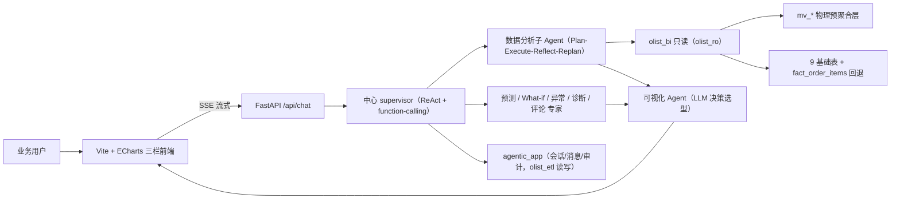
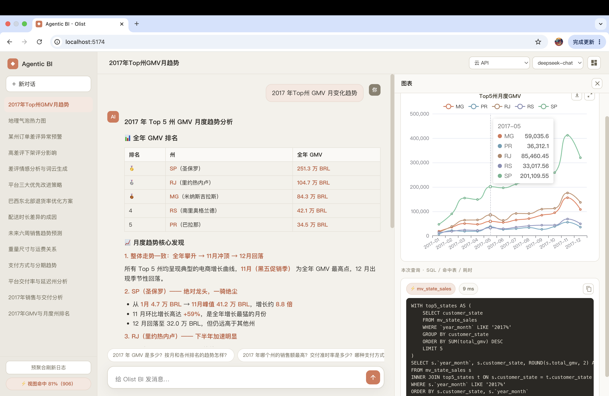
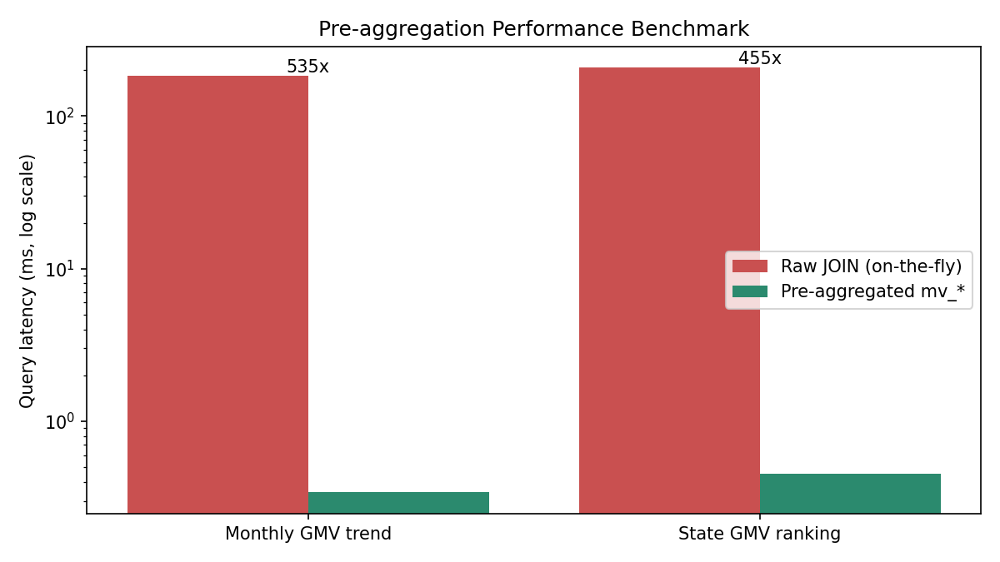
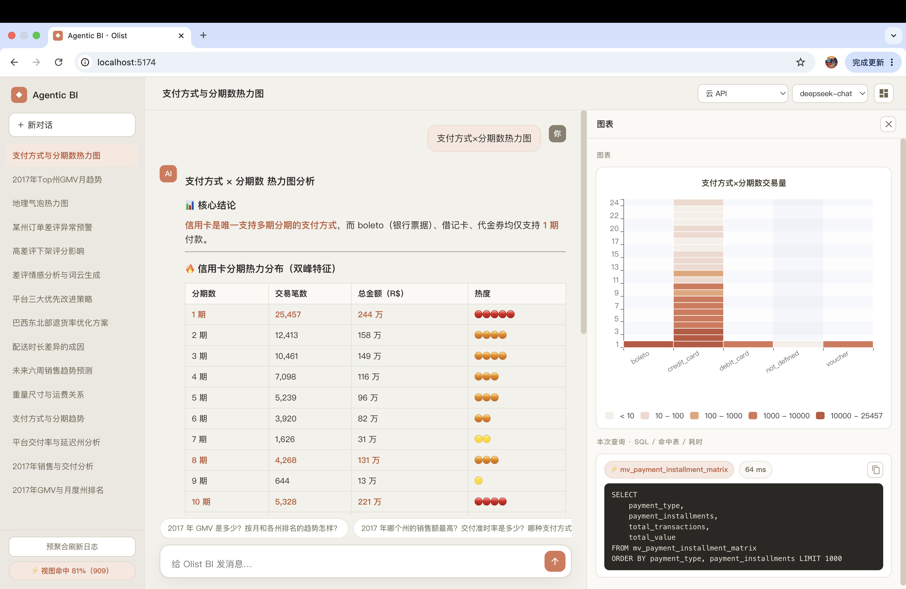
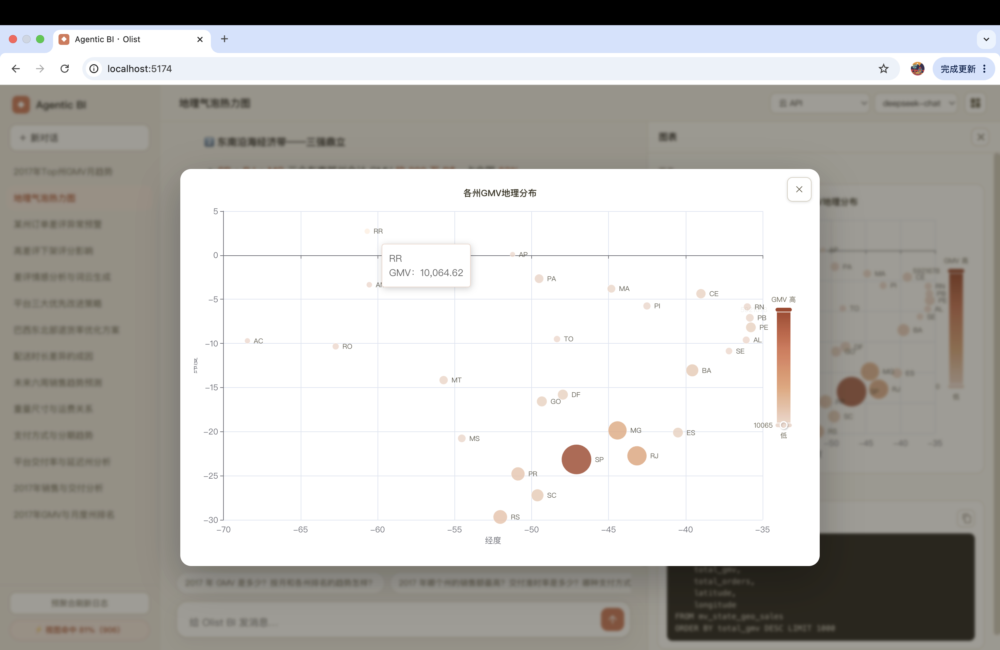
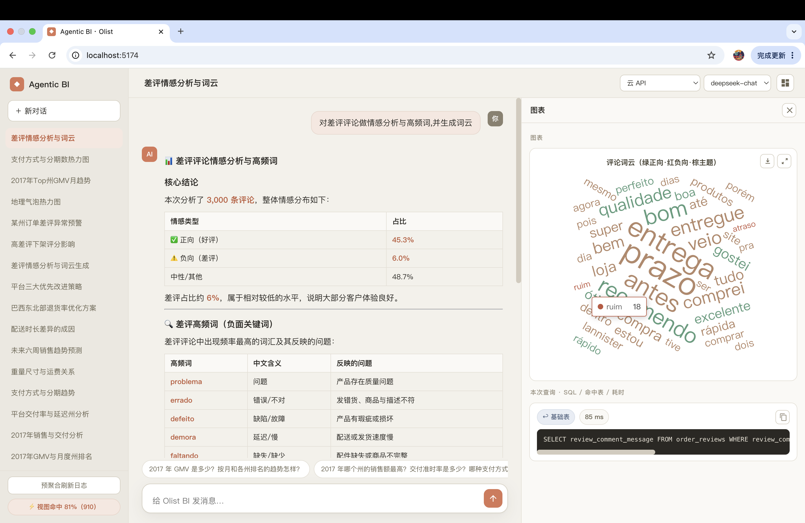
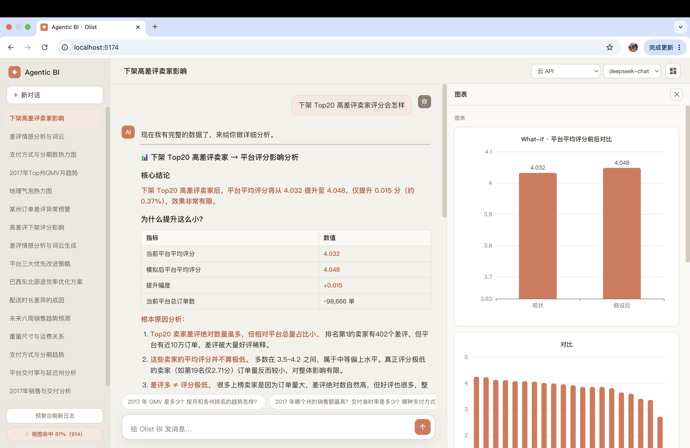
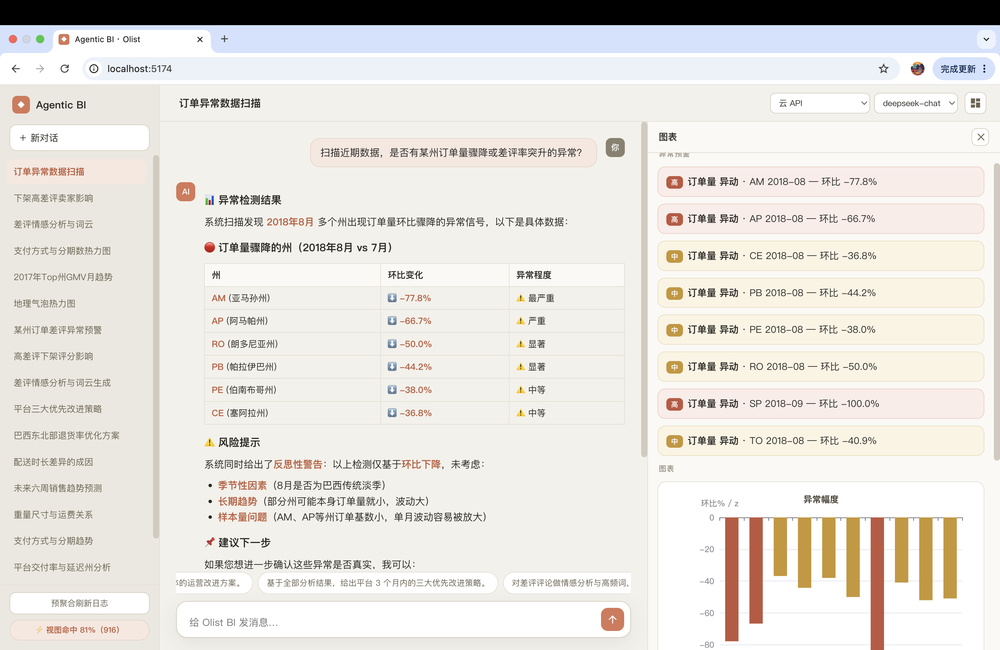
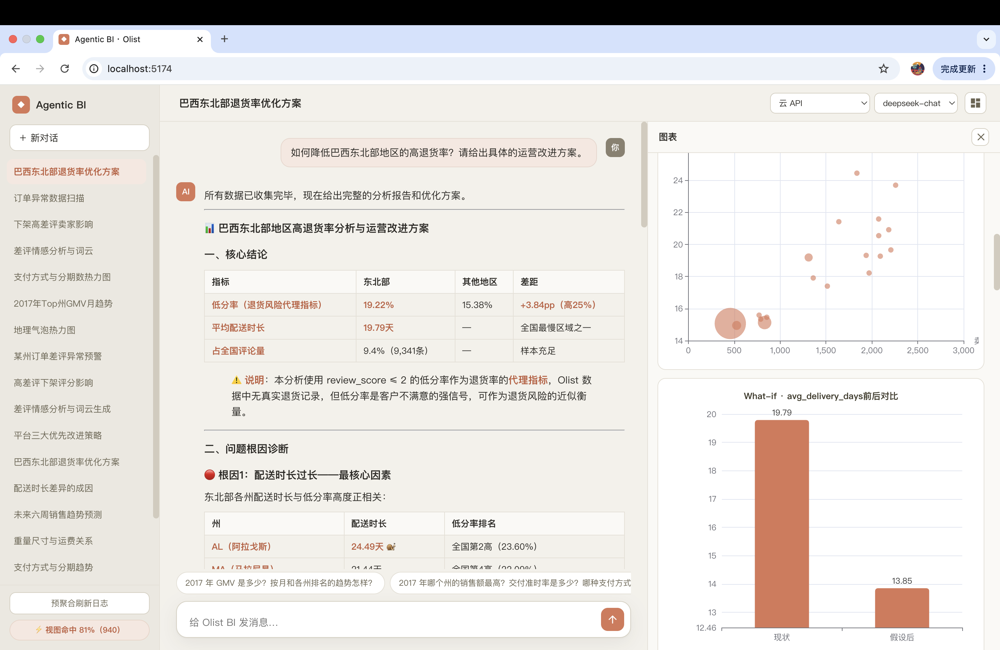

# Agentic BI 驱动的 Olist 多表电商运营分析与决策智能系统项目报告

## 1. 项目背景与动机

传统商业智能依赖分析人员手工编写 SQL、维护固定看板，业务人员只能被动解读指标。面对 Olist 这类覆盖订单、商品、卖家、支付、物流与评论文本的多表电商数据，固定看板难以应对临时业务问题，多表实时 JOIN 也会带来明显延迟。

本项目构建面向非技术业务人员的 Agentic BI 系统：用户用自然语言提问，系统自主规划任务、优先查询物理预聚合表、必要时回退基础表，按问题动态生成相关图表，并综合数据、预测、评论文本、What-if 与异常检测结果给出可执行建议。

项目目标：

- 降低跨表数据分析的使用门槛；
- 通过物理预聚合层提升高频查询响应速度；
- 用多智能体协作覆盖查询、可视化、文本洞察与决策；
- 为运营人员输出带对象、动作、指标的行动建议；
- 在数据库权限层面实现仓库数据与运行时数据的物理隔离，杜绝相互污染。

## 2. 系统架构设计

系统采用**三层物理分离**架构，并非单体应用：

```text
data_layer/   离线工具：建库 → 版本迁移 → 清洗装载9表 → 构建预聚合 → 校验/benchmark，跑完即退出
backend/      FastAPI + 中心 supervisor Agent + 专家子 Agent（ReAct / Plan-and-Execute / 工具调用）
frontend/     Vite + ECharts，左历史栏 / 中对话 / 右图表面板
```



### 2.1 两个物理隔离的数据库

| 库 | 内容 | 账号 |
| --- | --- | --- |
| `olist_bi` | 数据仓库：9 基础表 + `fact_order_items` 事实宽表 + 11 张可刷新物理预聚合表 `mv_*` + `mv_refresh_log` | Agent 运行时使用只读 `olist_ro` |
| `agentic_app` | 运行时业务：`conversations` / `messages`（含每条消息的图表与 SQL 产物）/ `query_route_log` 审计 | `olist_etl` 读写 |

数据互不污染：Agent 的只读账号在数据库权限层即**无法访问** `agentic_app`，也**无法写** `olist_bi`，从机制上避免历史结果污染当前问题。

### 2.2 单轮隔离与长短期记忆

每次提问创建独立运行状态，上一轮的查询结果不会污染当前问题；同一输入内的复合问题仍可在子问题之间传递年份、州等必要上下文。短期记忆为近期消息注入上下文，长期记忆为会话摘要持久化于 `agentic_app`，跨重启可恢复。

## 3. 关键技术选型说明

| 技术领域 | 选型 | 选型原因 |
| --- | --- | --- |
| 大语言模型 | DeepSeek（OpenAI 兼容）/ 本地 Ollama 可切换 | 自然语言转 SQL、结果解释与规范性建议；前端可按请求切换云/本地 |
| Agent 框架 | LangGraph `StateGraph` + MemorySaver | 中心 supervisor 的 ReAct 编排、条件路由与状态传递 |
| 查询引擎 | MySQL 8 | 多表 JOIN、物理汇总表与索引；多账号实现读写隔离 |
| 数据处理 | Pandas + SQLAlchemy + PyMySQL | CSV 清洗装载、DataFrame 处理与数据库访问 |
| 预测模型 | 对数尺度阻尼 Holt 趋势 | 从问题动态提取预测周数，`log1p(GMV)` 保证非负，经验残差给出 90% 区间 |
| NLP 方法 | 葡萄牙语情感词典 + 停用词 + 主题词频 | 对评论正文生成极性、主观性与主题关键词，正负向词云分色 |
| 可视化 | ECharts（前端）+ 可视化 Agent（LLM 决策） | Agent 决定画哪些图、用什么类型、如何编码、起什么标题，工具确定性渲染兜底 |
| Web 框架 | FastAPI + SSE | 流式返回 Agent 状态与结果；前端 Vite + 原生 ECharts |

## 4. 预聚合视图设计专节

### 4.1 物理预聚合表

系统采用可刷新的 MySQL 物理汇总表（而非逻辑 View），并建索引，以获得稳定的性能提升。

| 表名 | 粒度 | 核心用途 |
| --- | --- | --- |
| `mv_monthly_sales` | 年月 | GMV 趋势与客单价 |
| `mv_weekly_sales` | 周 | 动态周数 GMV 预测输入 |
| `mv_state_sales` | 年月、州 | 州级销售排名与区域对比 |
| `mv_category_sales` | 年月、品类 | 品类表现 |
| `mv_delivery_perf` | 年月、州 | 配送时长、准时率与延迟诊断 |
| `mv_payment_dist` | 年月、支付方式 | 支付偏好与平均分期数 |
| `mv_payment_installment_matrix` | 支付方式、分期数 | 支付×分期热力图 |
| `mv_weight_freight_bucket` | 重量分桶 | 重量、尺寸、运费与配送关系 |
| `mv_state_geo_sales` | 州 | 州级地理气泡图/热力图（含经纬度） |
| `mv_review_quality` | 年月、州、品类 | 评分与差评率 |
| `mv_seller_review_risk` | 卖家 | 高差评卖家定位与 What-if |

完整 SQL 见 `data_layer/sql/02_preaggregation.sql`，刷新脚本 `python -m utils.refresh_aggregations`。

### 4.2 Agent 利用与回退机制

数据分析 Agent 通过工具 `list_views` / `describe_view` 了解数据字典，Prompt 明确要求**优先命中 `mv_*`**；只有需要订单明细、评论正文或预聚合未覆盖的维度时，才 JOIN `fact_order_items` 或基础表。每次 `run_sql` 产出 `route_decision`（MV / BASE）并写入 `query_route_log` 审计。本项目**不使用黄金/模板 SQL**，全部由 LLM 在 ReAct 循环中实时编写，SQL 报错据错自我修正重试，避免对模板的过度依赖导致查不到数据时编造。

前端图表面板固定展示**本轮 SQL、命中数据源与查询耗时**，便于验证预聚合优先逻辑。



### 4.3 口径铁律（加权聚合）

跨期/跨组聚合率与均值时强制加权：`SUM(rate * cnt) / SUM(cnt)`，而非对各分组率求简单平均，避免小样本拉偏（如准时率）。该约束写入数据字典提示与反思质检。

### 4.4 性能对比

`data_layer/scripts/benchmark_preagg.py` 对同一分析问题分别执行原表 JOIN 实时聚合与物理预聚合查询，取每组最优耗时，输出 `data/processed/benchmark_report.json` 与英文标注的 `benchmark_report.png`。物理预聚合相对原表 JOIN 通常有**数十至上百倍**加速（具体数值以本地实测为准）。



## 5. 数据集描述与预处理步骤

使用 Brazilian E-Commerce Public Dataset by Olist，覆盖 2016–2018 年订单、商品、客户、卖家、支付、评论与地理信息。

### 5.1 九张基础表

| 表 | 主要内容 |
| --- | --- |
| `orders` | 订单状态与完整时间链路 |
| `order_items` | 商品、卖家、价格与运费 |
| `customers` | 客户唯一标识、城市与州 |
| `products` | 品类、重量与尺寸 |
| `sellers` | 卖家城市与州 |
| `order_payments` | 支付方式、分期数与金额 |
| `order_reviews` | 评分、标题与评论正文 |
| `geolocation` | 邮编、经纬度、城市与州 |
| `product_category_name_translation` | 葡萄牙语品类英文翻译 |

### 5.2 预处理流程（一键编排）

`data_layer` 入口 `python -m utils.init_db` 按序完成：

1. **建库**（admin/root）：创建 `olist_bi` 与 `agentic_app`。
2. **版本迁移**（yoyo migrations `0001–0004`）：创建 `olist_etl` / `olist_ro` 账号与权限、表结构、索引、日志表。
3. **清洗装载**（etl）：清洗 9 张 CSV 并装载，构建 `fact_order_items` 事实宽表，生成 `item_gmv`、`year_month`、`shipping_duration_days`、`is_on_time` 等衍生字段；缺送达时间的记录保留明细但在配送聚合中排除。
4. **刷新预聚合**（etl）：重建全部 `mv_*` 并写 `mv_refresh_log`，附自校验。

原始 9 个 CSV 放入 `data_layer/data/raw/`。

## 6. 智能体实现与多智能体调度

### 6.1 Agent 职责

| Agent | 核心职责 |
| --- | --- |
| 中心 supervisor | ReAct + function-calling，自主调用专家工具，观察结果后迭代或综合作答；不按维度拆分单个数据问题 |
| 数据分析子 Agent | Plan-and-Execute + Reflect + Replan：先产出显式计划并明确口径，ReAct 执行（`list_views`/`describe_view`/`run_sql`），反思不充分则重规划再执行，最后在源头甄别最终依据的查询 |
| 预测 Agent | 对数尺度阻尼 Holt 趋势预测，给 90% 置信区间 |
| What-if Agent | 通用反事实模拟，如下架 Top20 高差评卖家、运费下调等 |
| 异常检测 Agent | 对实体-时间-指标序列做环比与 z-score 检测 |
| 诊断 Agent | 配送延迟根因下钻：JOIN 地理表用 haversine 计算卖家-客户距离，分析距离与时长关系 |
| 评论 NLP Agent | 葡语情感极性、主观性、主题词频，输出正/负/主题分色词云 |
| 可视化 Agent | 由 LLM 按数据特征决定哪些数据值得画图、用何类型、如何编码、起何标题，工具确定性渲染并校验兜底 |
| 元/记忆 Agent | 处理与数据无关的消息（寒暄、历史回顾等） |

### 6.2 调度流程与自我纠错（ReAct + Reflexion + Plan-and-Execute）

中心 supervisor 收到问题后按需调用一个或多个专家工具，把完整问题原样交给数据分析子 Agent，由后者内部完成 Top N、过滤、分组与组合，避免按州/品类逐个拆分。数据分析子 Agent 内部形成闭环：

```text
Plan（显式计划 + 口径）→ Execute（ReAct 写并执行 SQL，优先一条组合 SQL）
   → Reflect（核对 Top N 个数、时间维度、加权口径、是否答到题型）
   → 不达标则 Replan 再执行（有界，最多 2 轮）→ 源头甄别最终结果
```

反思（Reflexion）对每步评估：例如「Top5 各州月度趋势」必须恰好 5 个州、且含逐期时间列，否则判不合格并要求用 CTE 先选 Top N 再 IN 过滤逐期数据。专家 Agent 也各带反思自评，提示样本不足、相关非因果、代理指标等局限。

### 6.3 动态可视化

可视化 Agent 不固定返回整套看板，而是按本轮问题与结果字段动态选型：时间序列→折线/分组折线；分类排名→柱状；占比→饼图；两数值关系→散点/气泡；两分类交叉→热力图；含经纬度→地理气泡图；评论→分色词云。无适合绘图的结构化字段时不强行出图。



## 7. 运行结果、分析解释与决策建议

### 7.1 描述性分析（本地实测）

- 2017 年销售额最高州：`SP`，GMV 约 `2,513,486`；
- 全国平均配送时长约 `12.4` 天，州间差异显著（最慢州约为最快州的 3 倍以上）；
- 最常用支付方式：`credit_card`（按交易笔数远超 boleto、voucher、debit_card）。

SP 州明显领先，是核心市场；区域集中度高，需兼顾核心区域履约稳定与其他州增长。

### 7.2 地理分析与气泡图

州级地理气泡图使用 `mv_state_geo_sales`（含经纬度），气泡位置为州级坐标、大小/颜色表示 GMV。数据分析 Agent 在「地理分布/地图/热力图」类问题中查询该视图，可视化 Agent 据经纬度选择 geo 气泡图。



### 7.3 评论文本与诊断分析

对约 3,000 条评论正文分析：正向主题如 `bom`、`recomendo`、`qualidade`；负向主题如 `problema`、`defeito`、`demora`。词云按情感分色（绿正向 / 红负向 / 棕主题）。配送诊断显示距离越远、跨州比例越高的州配送越慢，偏远北部州由地理距离主导。



### 7.4 预测性分析

预测使用 `mv_weekly_sales`，从问题提取预测周数（未指定默认 6 周），先取最长连续周度区间、排除两端不完整周，在 `log1p(GMV)` 尺度拟合阻尼 Holt 趋势并反变换为非负 GMV，区间取训练残差经验 90% 分位。预测数值由模型计算，LLM 仅基于模型证据生成解读，不自行编造预测值，也不会输出负 GMV，并明确区分「单周预测」与「合计预测」。

### 7.5 What-if、异常检测与决策建议

What-if 模拟下架 Top20 高差评卖家后平台平均评分的变化；异常检测识别近月订单量环比骤降或差评率突升的州。决策建议强制包含**对象、动作、指标**，并分高/中/低优先级：

- 物流：对异常下降州与高延迟区域建立周度预警，跟踪准时率与订单恢复；
- 卖家：对低评分、高差评、高延迟卖家分级治理，结合 What-if 决定限流或下架；
- 商品与客户：围绕 `defeito`、`demora` 等负向主题强化质检、包装与售后，按月复盘差评率。

代码强制声明：负面评价率为退货风险**代理指标**而非真实退货率；聚合只识别关联，因果需进一步验证。







## 8. 技术挑战与解决方案

| 技术挑战 | 解决方案 |
| --- | --- |
| 多表实时 JOIN 响应慢 | 11 张带索引物理预聚合表 + 一键刷新 + benchmark 基准 |
| 仓库数据与运行时数据相互污染 | 物理分库 + 多账号：`olist_ro` 只读仓库、`olist_etl` 读写运行库，权限层隔离 |
| 组合型问题规划不稳定（Top N 随时间） | 数据 Agent 改为 Plan-Execute-Reflect-Replan；反思核对实体个数与时间维度，重规划用 CTE 先选 Top N 再 IN 过滤 |
| 协调器把单个数据问题按州拆成多次查询 | supervisor 提示明确「拆分析、不拆查询」，整问题原样交给数据 Agent 内部组合 |
| LLM 生成 SQL 不稳定 | 只读 SQL 安全校验、数据字典工具、执行报错自我修正；放弃黄金 SQL 避免编造 |
| 月度边界异常导致预测为负 | 周度预聚合 + 排除不完整边界周 + 对数尺度短期模型 + 非负约束 |
| 固定图表与问题不相关、重复出图 | 可视化 Agent 按数据源与字段 LLM 决策选型；数据 Agent 在源头甄别最终结果，工具渲染兜底 |
| 评论文本为葡语且噪声多 | 葡语情感词典、停用词、主题词频生成结构化洞察并分色 |
| 决策建议空泛 | 强制包含对象、动作、指标与优先级，并提供确定性兜底 |
| 聚合被误读为因果/真实退货率 | 代码强制声明关联边界与代理指标说明 |
| 本地代理导致云端 LLM 偶发 SSL 中断 | 云端默认绕过系统代理直连，`CLOUD_USE_PROXY` 可切换，并加重试 |
